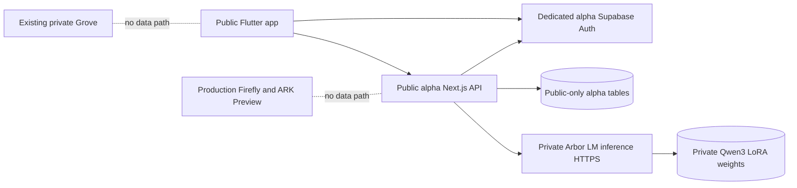

# Public Arbor App — isolated alpha plan (2026-09-21)

## Decision and boundaries

This is the **public Arbor App**, not the owner's private Grove. The existing repository is PUBLIC. Never commit the Grove's data, private adapter weights, personal examples, access keys, signed URLs, or private evaluation JSONL.

This branch is `arbor/public-app-alpha-20260921`, branched from `main`. Do not switch Vercel production deployment, ARK live execution, or Firefly's current database. A dedicated, empty Supabase alpha project and separate Vercel alpha project are required before testing with real accounts; do not point public clients at Firefly or ARK Preview. Do not create billable resources without approval.

## Verified inventory

| Area | Found | Alpha disposition |
| --- | --- | --- |
| Flutter | `apps/frontend`: Material app, ArborVisual, Text/Voice views, API client, auth in ChatTestPage, per-user ArborSession | Reuse generic visual and authenticated client; new public-only entry point. Do not expose development screen or connect legacy voice to public data. |
| Backend | `apps/backend`: Next.js `/api/chat`, Supabase auth, ownership checks, conversations, memory and safety | Leave canonical chat untouched; dedicated `/api/public/*` routes and schema. |
| Model | `lib/providers/openai.ts` and `/api/chat` OpenAI agent path | New fail-closed Arbor LM HTTP adapter. NO silent OpenAI fallback. |
| Supabase | Firefly has existing user messages and private continuity; Firefly ARK Preview is a separate active ARK test installation | Neither serves public accounts. SQL migration proposed but NOT run against those environments. |
| Hosting | Existing Vercel `firefly` project | Isolated alpha project needs separate environment and preview protections. |
| Tests | Vitest backend tests, Flutter widget tests, GitHub Actions `arbor-ci.yml` | Add public adapter and contract tests, build as draft PR, report actual CI status. |
| Model evaluation | Private v0.3 LoRA paired evaluation: 12 prompts x 2 model variants, seed 11 | Retain existing private artifacts unchanged. Do not commit weights/results. |

## First vertical slice

1. User signs up with Supabase Auth on dedicated alpha database. Email confirmation if configured; backend test allowlist enforced **server-side**.
2. Flutter `lib/public/main_public.dart` boots only when supplied dedicated alpha URL and publishable key, and calls an isolated alpha API origin.
3. `POST /api/public/chat` validates JWT, confirmed email, allowlist, input and ownership. All persistence uses public-only tables, independent of Grove and private ARK namespaces.
4. The inference adapter calls a server-authenticated Arbor LM service. It rejects absent URL/token, timeout, non-2xx, wrong model, malformed response, or empty reply, with no invented assistant text.
5. Chat history comes from `GET /api/public/conversations` and `GET /api/public/conversations/[id]` (JWT + user ownership). Current conversation is restored after sign-out/sign-in using server data.
6. Alpha explicitly does not claim voice continuity, public memory, therapist status, production safety review, account deletion or device-tested APK until separately verified.

## Architecture

Service credentials belong ONLY in alpha backend server environment. Publishable Supabase key and URL are client-side values and **must refer to alpha project**. Never expose service role credentials to Flutter.

## Alpha acceptance tests — not yet passed

- Account A: sign up, confirm if required, sign in; denied unless alpha allowlisted.
- A: send turn T1 and receive actual v0.3 reply with observed model identity from inference; leave/restart/sign in, retrieve T1 and assistant reply, send T2.
- B: separate account; cannot retrieve A's conversation by guessing ID; no search or memory contamination.
- Unauthenticated request: 401; not-allowlisted: 403; other owner: 404.
- Empty/model-down/malformed/timeout: surfaced as failure and **no synthetic reply**.
- Two concurrent sends with identical turnId: no duplicate completion.
- Mobile Android build and text/voice continuity: later gate after backend vertical slice and a real alpha configuration.

## Safeguards and release gates

This is conversational software, not a licensed therapist, crisis service, or validated treatment. Before wider testing: crisis-response behavior, consent and sensitive-data retention policy, abuse controls, data export/deletion, accessibility, clinical/legal/privacy review, security audit, and an actual cross-user penetration test. Model-generated reassurances do not substitute for these controls.

Supabase security linter found multiple RLS-enabled tables with no policies and reported security-definer investigation views in Firefly. An RLS-enabled/no-policy table may be intentionally inaccessible; investigate grants and context before judging severity. Do not copy unrelated privileged views to the public alpha database.

## the owner's technical handbook — starting vocabulary

- **Frontend** is what a person sees, taps, and speaks into. Flutter builds that app.
- **Backend** authenticates requests, checks permissions, saves history, and routes model calls. Next.js is our backend.
- **Supabase Auth** issues session tokens. The API verifies them; a user ID sent by the phone is never accepted as proof of identity.
- **Database isolation** means user's history belongs to their authenticated ID, verified both in code and database permissions.
- **Inference** is running the trained Arbor LM adapter to generate a reply. Training a model and running an inference service are different tasks.
- **ARK/Arbor Layer** are existing infrastructure, not permission to copy the Grove's state into public accounts.
- **A green build** proves code checks completed, not that a human can sign up and talk to a deployed model.

## Honest pending blockers

1. No verified hosted v0.3 HTTPS inference endpoint or server token.
2. No dedicated alpha Supabase/Vercel resources verified or configured. Resource cost/approval gate applies.
3. No live new-user, cross-user, Android APK or inference E2E receipts.
4. Manual first evaluation highlights correction uptake and unsupported completion claims; further controlled evaluation needed.

Do not mark the private alpha working until actual end-to-end receipts exist.

## Continuation branch checkpoint — public history and portability

This continuation is in draft PR #146, stacked on original draft PR #140.
The source branch is `arbor/public-alpha-continuity-privacy-20260921`.
Neither PR may be merged independently; neither authorizes production changes.

### Newly written code (NOT deployed acceptance evidence)

- GET one conversation fetches newest 100 turns first, with an explicit offset and
  `hasMore` / `nextOffset` for older pages; invalid offsets return 400. This
  changes the former 200-message first-page ceiling. The public Flutter surface
  can load earlier turns, and view revision checks discard stale history
  responses after switching conversations. Reopening favors the latest
  unfinished user turn. Pagination is bounded at offset 10000 and requires
  a larger-history design before unrestricted archives or UI history claims.
- An explicitly requested `GET /api/public/conversations?export=1` returns
  public-alpha conversations and messages belonging to the authenticated
  user. Every query includes `user_id`. The archive fails with 413 rather
  than falsely reporting completion above 2000 conversations or 20000 turns.
  The Flutter alpha offers explicit clipboard copying after a device-privacy
  warning. This is not a permanent file download and the OS clipboard may
  retain content. It is not a GDPR/CCPA compliance assertion.
- Public JSON responses now carry `cache-control: private, no-store` and
  `x-content-type-options: nosniff`.
- Synthetic user A/B query-scoping and archive boundary tests added.
  These are mocks, not an isolated real Postgres cross-user RLS test.

### Prioritized follow-up still required

1. Confirm exact-child-head backend tests, Flutter analyze, public Android debug
   build, and integration checks. A green parent is NOT a green child.
2. Validate retry races across two actual alpha API instances: one user turn ID
   may currently trigger two simultaneous inference calls; the DB uniqueness
   protects stored assistant duplication but does NOT make inference single
   flight. Add a durable DB claim/lease and replacement-worker test on the
   isolated alpha database before advertising retry-idempotent execution.
3. Run two synthetic confirmed invite accounts on the **dedicated public**
   Supabase and alpha API; verify each user's JWT, conversations, exports,
   corrections, and deletions never disclose or mutate the other's data.
   Include mismatched conversation/turn IDs, expired tokens and re-authentication.
4. Check same-account sign-out/sign-in, app force-close/relaunch, the latest
   incomplete turn, earlier-page loads above 200 messages, and new account with
   zero history on a real Android device. Disable/re-enable network mid-send.
5. Design and review a public-only, explicitly consented memory schema and
   CRUD/export/delete controls. Do NOT read private Firefly, ARK Preview, or
   Grove memories. Do not claim durable public memory until these controls and
   server-side retrieval actually work and are accepted.
6. Design public ARK project grants separately from ChatGPT/owner ARK Preview.
   Default is NO attachment: enforce project owner, account, task authorization,
   input provenance, read/write scope, and response minimization at the API.
   Only expose scoped status/continuity after a real two-account test; never
   accept phone-supplied userId as identity.
7. Validate Arbor LM v0.3 hosted exact adapter/version from the private
   artifact store without checking weights or private evaluation prompts
   into this public repo. The gateway must fail closed on unavailable/model
   mismatch and may not make unsupported action or clinical claims.
8. Before any mental-wellness feature testing with people: define supported
   use cases, minimum age/consent posture, immediate-danger response,
   escalation language, self-harm and delusion/mania evaluation,
   human-support routes, model uncertainty, incident handling, and a review
   process. Software must not imply active emergency monitoring or act as
   a licensed clinician. No clinical validation or regulatory approval claimed.
9. Obtain product/privacy review of data purpose, disclosures, processor
   terms, transmission, access logs, retention clocks, backups, deletion from
   backups, full account deletion, user export size limits, model-input use,
   and policy for sensitive data. Conversation deletion != account deletion.
10. Run real Android accessibility acceptance: screen reader traversal,
    text scaling, keyboard, high contrast, error visibility, long-scroll
    performance, slower network and reduced executive-function load.
11. Invite-only alpha must have explicit rollout and rollback decisions,
    service-cost limits, capacity alerts, incident contact, and documented
    synthetic-fixture cleanup. No wider release on compilation alone.

### Real-device alpha acceptance criteria

- New invited A can register, confirm email and sign in; new uninvited B is
  denied by server even if Flutter is modified.
- A's first turn returns *actual hosted v0.3* model identity; model-down
  produces an explicit unavailable state without fabricated reply.
- A closes/reopens and recovers the last full turn, and an unanswered turn
  retries with exactly its persisted turn ID without a duplicate saved turn.
- B, with its own alpha invite, cannot read, export, delete or send within A's
  conversation, including a guessed UUID and simultaneous sessions.
- A navigates more than 200 turns and earlier pages without losing the
  newest pending state or displaying a stale previous-thread response.
- A can export public data, delete a conversation, confirm that its child
  messages are absent on reread/export, and verify B's history remains intact.
- Confirm owner-scoped memory/correction behavior only *after it exists*.
  No claim of Text/Voice continuity or public ARK work execution in this slice.

### Truth ledger

`written`: public history pagination, clipboard archive UI, scoped archive
API, no-store headers, synthetic regressions. `verified`: parent PR #140
has exact-head CI receipts; child PR #146 needs its own exact-head receipts.
`not deployed`: isolated alpha DB, API, model GPU/HTTPS; no costs incurred.
`not passed`: real users, real device, cross-user Postgres RLS and model
conversation end-to-end. `not implemented`: long-term public memory,
user-wide deletion, ARK attachment, clinical/wellness evaluation.
