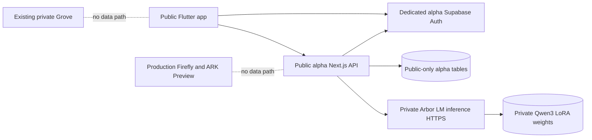

# Public Arbor App — isolated alpha plan (2026-09-21)

## Decision and boundaries

This is the **public Arbor App**, not Danelle's private Grove. The existing repository is PUBLIC. Never commit the Grove's data, private adapter weights, personal examples, access keys, signed URLs, or private evaluation JSONL.

This branch is `arbor/public-app-alpha-20260921`, branched from `main`. Do not switch Vercel production deployment, ARK live execution, or Firefly's current database. A dedicated, empty Supabase alpha project and separate Vercel alpha project are required before testing with real accounts; do not point public clients at Firefly or ARK Preview. Do not create billable resources without approval.

## Verified inventory

| Area | Found | Alpha disposition |
| --- | --- | --- |
| Flutter | `apps/frontend`: Material app, ArborVisual, Text/Voice views, API client, auth in ChatTestPage, per-user ArborSession | Reuse generic visual and authenticated client; new public-only entry point. Do not expose development screen or connect legacy voice to public data. |
| Backend | `apps/backend`: Next.js `/api/chat`, Supabase auth, ownership checks, conversations, memory and safety | Leave canonical chat untouched; dedicated `/api/public/*` routes and schema. |
| Model | `lib/providers/openai.ts` and `/api/chat` OpenAI agent path | New fail-closed Arbor LM HTTP adapter. NO silent OpenAI fallback. |
| Supabase | Firefly has existing user messages and private continuity; Firefly ARK Preview is a separate active ARK test installation | Neither serves public accounts. SQL migration proposed but NOT run against those environments. |
| Hosting | Existing Vercel `firefly` project | Isolated alpha project needs separate environment and preview protections. |
| Tests | Vitest backend tests, Flutter widget tests, GitHub Actions `arbor-ci.yml` | Add public adapter and contract tests, build as draft PR, report actual CI status. |
| Model evaluation | Private v0.3 LoRA paired evaluation: 12 prompts x 2 model variants, seed 11 | Retain existing private artifacts unchanged. Do not commit weights/results. |

## First vertical slice

1. User signs up with Supabase Auth on dedicated alpha database. Email confirmation if configured; backend test allowlist enforced **server-side**.
2. Flutter `lib/public/main_public.dart` boots only when supplied dedicated alpha URL and publishable key, and calls an isolated alpha API origin.
3. `POST /api/public/chat` validates JWT, confirmed email, allowlist, input and ownership. All persistence uses public-only tables, independent of Grove and private ARK namespaces.
4. The inference adapter calls a server-authenticated Arbor LM service. It rejects absent URL/token, timeout, non-2xx, wrong model, malformed response, or empty reply, with no invented assistant text.
5. Chat history comes from `GET /api/public/conversations` and `GET /api/public/conversations/[id]` (JWT + user ownership). Current conversation is restored after sign-out/sign-in using server data.
6. Alpha explicitly does not claim voice continuity, public memory, therapist status, production safety review, account deletion or device-tested APK until separately verified.

## Architecture

Service credentials belong ONLY in alpha backend server environment. Publishable Supabase key and URL are client-side values and **must refer to alpha project**. Never expose service role credentials to Flutter.

## Alpha acceptance tests — not yet passed

- Account A: sign up, confirm if required, sign in; denied unless alpha allowlisted.
- A: send turn T1 and receive actual v0.3 reply with observed model identity from inference; leave/restart/sign in, retrieve T1 and assistant reply, send T2.
- B: separate account; cannot retrieve A's conversation by guessing ID; no search or memory contamination.
- Unauthenticated request: 401; not-allowlisted: 403; other owner: 404.
- Empty/model-down/malformed/timeout: surfaced as failure and **no synthetic reply**.
- Two concurrent sends with identical turnId: no duplicate completion.
- Mobile Android build and text/voice continuity: later gate after backend vertical slice and a real alpha configuration.

## Safeguards and release gates

This is conversational software, not a licensed therapist, crisis service, or validated treatment. Before wider testing: crisis-response behavior, consent and sensitive-data retention policy, abuse controls, data export/deletion, accessibility, clinical/legal/privacy review, security audit, and an actual cross-user penetration test. Model-generated reassurances do not substitute for these controls.

Supabase security linter found multiple RLS-enabled tables with no policies and reported security-definer investigation views in Firefly. An RLS-enabled/no-policy table may be intentionally inaccessible; investigate grants and context before judging severity. Do not copy unrelated privileged views to the public alpha database.

## Danelle's technical handbook — starting vocabulary

- **Frontend** is what a person sees, taps, and speaks into. Flutter builds that app.
- **Backend** authenticates requests, checks permissions, saves history, and routes model calls. Next.js is our backend.
- **Supabase Auth** issues session tokens. The API verifies them; a user ID sent by the phone is never accepted as proof of identity.
- **Database isolation** means user's history belongs to their authenticated ID, verified both in code and database permissions.
- **Inference** is running the trained Arbor LM adapter to generate a reply. Training a model and running an inference service are different tasks.
- **ARK/Arbor Layer** are existing infrastructure, not permission to copy the Grove's state into public accounts.
- **A green build** proves code checks completed, not that a human can sign up and talk to a deployed model.

## Honest pending blockers

1. No verified hosted v0.3 HTTPS inference endpoint or server token.
2. No dedicated alpha Supabase/Vercel resources verified or configured. Resource cost/approval gate applies.
3. No live new-user, cross-user, Android APK or inference E2E receipts.
4. Manual first evaluation highlights correction uptake and unsupported completion claims; further controlled evaluation needed.

Do not mark the private alpha working until actual end-to-end receipts exist.
